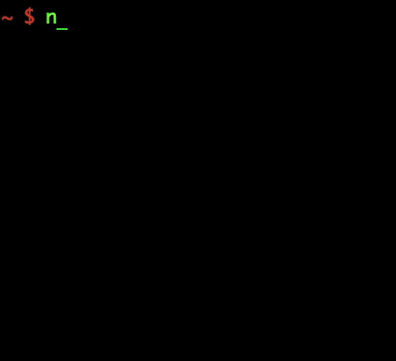

ncl - Navigable Calendar
========================

A navigable version of the in-built calendar (cal).

Works on: macOS, Linux

Installation
------------
Download the [release](https://github.com/codeliveroil/ncl/archive/v1.0.zip), unzip and run install.sh

Usage
-----
```
ncl -h
```

Examples
--------
```
ncl
ncl 8
ncl 8 2017
```

Demo
----

